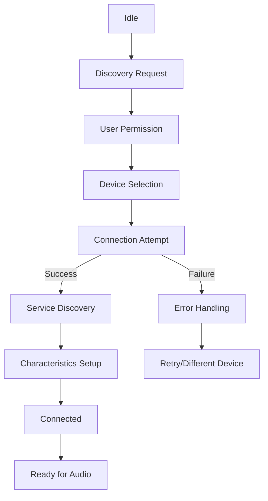
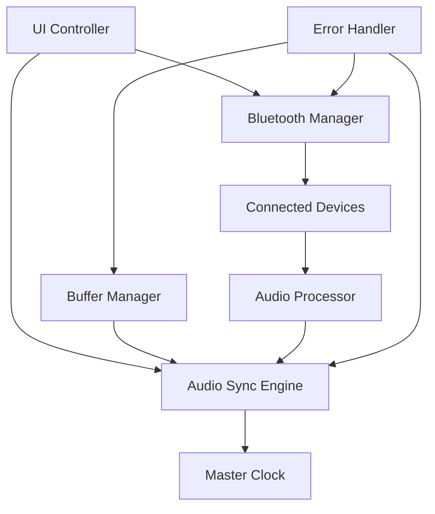
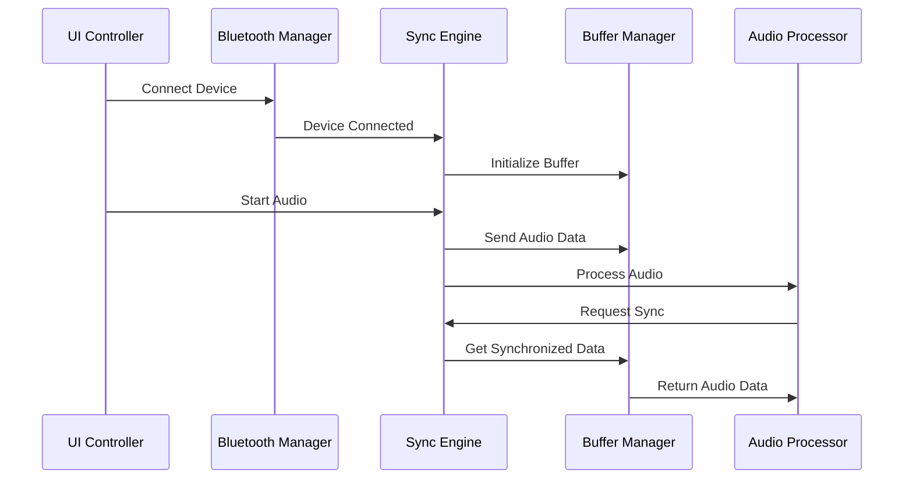

# Web Bluetooth Audio Synchronization Architecture

## Executive Summary

This document outlines the comprehensive technical architecture for a Web Bluetooth audio synchronization system that connects to multiple Bluetooth devices and plays synchronized audio across all connected devices. The system addresses the challenges of Web Bluetooth API limitations, audio synchronization complexity, and multi-device coordination.

## Table of Contents

1. [Web Bluetooth API Strategy](#web-bluetooth-api-strategy)
2. [Audio Synchronization Framework](#audio-synchronization-framework)
3. [System Architecture](#system-architecture)
4. [Technical Implementation Plan](#technical-implementation-plan)
5. [Testing and Validation](#testing-and-validation)
6. [Performance Considerations](#performance-considerations)
7. [Security and Privacy](#security-and-privacy)

## 1. Web Bluetooth API Strategy

### 1.1 Browser Compatibility and Limitations Analysis

**Current Browser Support:**
- **Chrome/Edge**: Full support with HTTPS requirement
- **Safari**: Limited support (iOS 13+, macOS 14.1+)
- **Firefox**: No support (behind flags)
- **Opera**: Chromium-based support

**Key Limitations:**
1. **HTTPS Requirement**: All operations require secure context
2. **User Gesture Required**: Device selection UI must be triggered by user interaction
3. **Single Device Per Request**: Cannot request multiple devices simultaneously
4. **Profile Restrictions**: Limited to GATT-based profiles (A2DP not directly accessible)
5. **Permission Model**: Each session requires explicit user permission

**Workaround Strategy:**
```javascript
// Sequential device connection with user permission for each
async function connectMultipleDevices(deviceConfigs) {
    const connectedDevices = [];
    
    for (const config of deviceConfigs) {
        try {
            const device = await requestDevice({
                filters: [config.filter],
                optionalServices: config.optionalServices
            });
            
            const server = await device.gatt.connect();
            connectedDevices.push({ device, server, config });
            
            // Prompt user for next device
            await showNextDevicePrompt();
        } catch (error) {
            console.error(`Failed to connect to device: ${error}`);
        }
    }
    
    return connectedDevices;
}
```

### 1.2 Security Requirements and User Permission Flows

**Permission Hierarchy:**
1. **Device Discovery Permission**: User must click to discover devices
2. **Connection Permission**: Separate permission for each device
3. **Service Access Permission**: Required for each GATT service
4. **Characteristic Permission**: Required for each characteristic access

**Security Implementation:**
```javascript
// Secure permission handling
class BluetoothPermissionManager {
    async requestDeviceConnection(deviceConfig) {
        // Validate security context
        if (location.protocol !== 'https:') {
            throw new Error('HTTPS required for Web Bluetooth');
        }

        // Request device with proper error handling
        try {
            const device = await navigator.bluetooth.requestDevice({
                filters: [deviceConfig.filter],
                optionalServices: deviceConfig.optionalServices
            });

            // Set up device event listeners
            device.addEventListener('gattserverdisconnected', 
                () => this.handleDisconnection(device)
            );

            return device;
        } catch (error) {
            this.handlePermissionError(error);
            throw error;
        }
    }
}
```

### 1.3 Device Discovery and Connection Management Architecture

**Connection State Machine:**


**Device Manager Architecture:**
```javascript
class DeviceManager {
    constructor() {
        this.devices = new Map();
        this.connectionState = new Map();
        this.eventEmitter = new EventTarget();
    }

    async connectDevice(deviceConfig) {
        const deviceId = this.generateDeviceId();
        
        try {
            this.updateConnectionState(deviceId, 'discovering');
            const device = await this.permissionManager.requestDeviceConnection(deviceConfig);
            
            this.updateConnectionState(deviceId, 'connecting');
            const server = await device.gatt.connect();
            
            this.updateConnectionState(deviceId, 'services');
            const services = await this.discoverServices(server, deviceConfig.services);
            
            this.updateConnectionState(deviceId, 'characteristics');
            const characteristics = await this.setupCharacteristics(services);
            
            this.updateConnectionState(deviceId, 'connected');
            
            return {
                id: deviceId,
                device,
                server,
                services,
                characteristics,
                config: deviceConfig
            };
        } catch (error) {
            this.updateConnectionState(deviceId, 'error', error);
            throw error;
        }
    }
}
```

## 2. Audio Synchronization Framework

### 2.1 Audio Timing and Synchronization Algorithms

**Master Clock Synchronization:**
```javascript
class AudioSyncEngine {
    constructor() {
        this.masterClock = new MasterClock();
        this.deviceClocks = new Map();
        this.syncThreshold = 0.001; // 1ms tolerance
        this.bufferSize = 2048; // Audio buffer size
        this.sampleRate = 44100;
    }

    // Synchronization algorithm
    async synchronizeDevices(devices) {
        const syncStartTime = this.masterClock.getCurrentTime();
        
        // Send sync signal to all devices
        const syncPromises = devices.map(device => 
            this.sendSyncSignal(device, syncStartTime)
        );
        
        await Promise.all(syncPromises);
        
        // Calculate drift compensation
        const adjustments = await this.calculateDriftCompensation(devices);
        
        // Apply adjustments
        for (const [deviceId, adjustment] of adjustments) {
            await this.applyDriftCompensation(deviceId, adjustment);
        }
    }

    // Drift compensation algorithm
    calculateDriftCompensation(devices) {
        const masterTime = this.masterClock.getCurrentTime();
        const adjustments = new Map();

        for (const device of devices) {
            const deviceTime = device.clock.getCurrentTime();
            const drift = masterTime - deviceTime;
            
            if (Math.abs(drift) > this.syncThreshold) {
                adjustments.set(device.id, this.calculateTimeAdjustment(drift));
            }
        }

        return adjustments;
    }
}
```

### 2.2 Latency Compensation Strategies

**Latency Measurement and Compensation:**
```javascript
class LatencyCompensation {
    constructor() {
        this.latencyMap = new Map();
        this.measurementInterval = 1000; // 1 second
    }

    async measureLatency(device) {
        const startTime = performance.now();
        
        // Send ping request
        await this.sendPing(device);
        
        const endTime = performance.now();
        const roundTripTime = endTime - startTime;
        const oneWayLatency = roundTripTime / 2;
        
        this.latencyMap.set(device.id, oneWayLatency);
        
        return oneWayLatency;
    }

    compensateForLatency(device, audioTimestamp) {
        const latency = this.latencyMap.get(device.id) || 0;
        const adjustedTimestamp = audioTimestamp + latency;
        
        return adjustedTimestamp;
    }
}
```

### 2.3 Buffer Management and Audio Drift Correction

**Circular Buffer Management:**
```javascript
class AudioBuffer {
    constructor(bufferSize, sampleRate) {
        this.bufferSize = bufferSize;
        this.sampleRate = sampleRate;
        this.buffers = new Map(); // deviceId -> buffer
        this.writePosition = 0;
        this.readPosition = 0;
    }

    // Add audio data to buffer
    writeAudio(deviceId, audioData, timestamp) {
        if (!this.buffers.has(deviceId)) {
            this.buffers.set(deviceId, new Float32Array(this.bufferSize));
        }

        const buffer = this.buffers.get(deviceId);
        const samples = audioData.length;
        
        // Write with timestamp validation
        for (let i = 0; i < samples; i++) {
            buffer[this.writePosition] = audioData[i];
            this.writePosition = (this.writePosition + 1) % this.bufferSize;
        }

        this.syncCheck(deviceId, timestamp);
    }

    // Read synchronized audio data
    readAudio(deviceId, timestamp) {
        const buffer = this.buffers.get(deviceId);
        if (!buffer) return null;

        // Calculate required read position based on timestamp
        const targetPosition = this.calculateTargetPosition(deviceId, timestamp);
        const synchronizedData = this.extractSynchronizedData(buffer, targetPosition);

        return synchronizedData;
    }

    // Drift correction algorithm
    correctDrift(deviceId, driftAmount) {
        const buffer = this.buffers.get(deviceId);
        if (!buffer) return;

        if (driftAmount > 0) {
            // Device is behind, skip samples
            this.skipSamples(deviceId, Math.abs(driftAmount));
        } else if (driftAmount < 0) {
            // Device is ahead, duplicate samples
            this.duplicateSamples(deviceId, Math.abs(driftAmount));
        }
    }
}
```

## 3. System Architecture

### 3.1 Component Breakdown and Responsibilities

**Core Components:**

1. **BluetoothManager**: Device discovery, connection, and management
2. **AudioSyncEngine**: Master clock and synchronization algorithms
3. **BufferManager**: Audio buffer management and drift correction
4. **UIController**: User interface and device management
5. **AudioProcessor**: Audio processing and output handling
6. **ErrorHandler**: Error recovery and fallback mechanisms



### 3.2 Data Flow Between Components

**Data Flow Architecture:**


### 3.3 Error Handling and Recovery Mechanisms

**Error Handling Strategy:**
```javascript
class ErrorHandler {
    constructor() {
        this.retryStrategies = new Map();
        this.fallbackMechanisms = new Map();
    }

    async handleConnectionError(deviceId, error) {
        console.error(`Connection error for device ${deviceId}:`, error);

        const strategy = this.getRetryStrategy(error);
        
        if (strategy) {
            await this.attemptRecovery(deviceId, strategy);
        } else {
            await this.initiateFallback(deviceId);
        }
    }

    async handleSyncError(deviceId, error) {
        console.error(`Sync error for device ${deviceId}:`, error);

        // Reduce sync requirements temporarily
        await this.adjustSyncTolerance(deviceId);
        
        // Restart synchronization
        await this.restartSync(deviceId);
    }

    async handleAudioError(deviceId, error) {
        console.error(`Audio error for device ${deviceId}:`, error);

        // Switch to fallback audio output
        await this.switchToFallback(deviceId);
        
        // Notify user of degraded performance
        this.notifyUserOfDegradation(deviceId);
    }
}
```

## 4. Technical Implementation Plan

### 4.1 File Structure and Organization

```
web-bluetooth-audio-sync/
├── src/
│   ├── core/
│   │   ├── bluetooth/
│   │   │   ├── DeviceManager.js
│   │   │   ├── BluetoothPermissionManager.js
│   │   │   ├── ConnectionStateMachine.js
│   │   │   └── ServiceDiscovery.js
│   │   ├── audio/
│   │   │   ├── AudioSyncEngine.js
│   │   │   ├── BufferManager.js
│   │   │   ├── LatencyCompensation.js
│   │   │   └── AudioProcessor.js
│   │   ├── clock/
│   │   │   ├── MasterClock.js
│   │   │   ├── DeviceClock.js
│   │   │   └── DriftCorrection.js
│   │   └── utils/
│   │       ├── EventEmitter.js
│   │       ├── ErrorHandler.js
│   │       ├── Logger.js
│   │       └── TimeUtils.js
│   ├── ui/
│   │   ├── components/
│   │   │   ├── DeviceSelector.js
│   │   │   ├── ConnectionStatus.js
│   │   │   ├── SyncMonitor.js
│   │   │   └── AudioControls.js
│   │   ├── styles/
│   │   │   └── main.css
│   │   └── MainController.js
│   ├── config/
│   │   ├── DeviceProfiles.js
│   │   ├── AudioSettings.js
│   │   └── SyncParameters.js
│   └── main.js
├── tests/
│   ├── unit/
│   ├── integration/
│   └── e2e/
├── docs/
│   ├── api-reference.md
│   ├── troubleshooting.md
│   └── performance-guide.md
├── examples/
│   ├── basic-setup.html
│   └── advanced-sync.html
└── assets/
    ├── icons/
    └── audio-samples/
```

### 4.2 Key Algorithms and Implementation Approach

**1. Device Connection Algorithm:**
```javascript
// Pseudocode for multi-device connection
class MultiDeviceConnector {
    async connectDevices(deviceConfigs, maxConcurrent = 3) {
        const connectionPool = new ConnectionPool(maxConcurrent);
        const connections = [];

        for (const config of deviceConfigs) {
            try {
                const connection = await connectionPool.acquire();
                const device = await this.establishConnection(config);
                
                connections.push({
                    device,
                    config,
                    connection,
                    status: 'connected'
                });
                
                connectionPool.release(connection);
            } catch (error) {
                await this.handleConnectionFailure(config, error);
            }
        }

        return connections;
    }
}
```

**2. Audio Synchronization Algorithm:**
```javascript
// Master synchronization algorithm
class MasterSyncAlgorithm {
    constructor() {
        this.tolerance = 0.001; // 1ms
        this.lookahead = 0.1; // 100ms
        this.oversampling = 4; // 4x oversampling for drift calculation
    }

    async synchronizePlayback(audioData, deviceConnections) {
        const masterTimestamp = this.getMasterTimestamp();
        const syncPlan = this.createSyncPlan(audioData, masterTimestamp);
        
        // Calculate individual device adjustments
        const deviceAdjustments = await this.calculateDeviceAdjustments(
            deviceConnections, 
            syncPlan
        );

        // Apply synchronized playback
        await this.executeSynchronizedPlayback(deviceAdjustments);
    }

    createSyncPlan(audioData, masterTimestamp) {
        const plan = {
            startTime: masterTimestamp + this.lookahead,
            devices: new Map(),
            duration: audioData.length / this.sampleRate
        };

        return plan;
    }
}
```

### 4.3 Fallback Mechanisms for Unsupported Browsers

**Browser Support Strategy:**
```javascript
class BrowserCompatibilityManager {
    constructor() {
        this.supportedFeatures = this.detectSupportedFeatures();
        this.fallbackStrategies = this.initFallbackStrategies();
    }

    detectSupportedFeatures() {
        return {
            webBluetooth: !!navigator.bluetooth,
            webAudio: !!window.AudioContext,
            webUSB: !!navigator.usb,
            serviceWorker: 'serviceWorker' in navigator
        };
    }

    async initializeApplication() {
        if (!this.supportedFeatures.webBluetooth) {
            await this.initiateWebBluetoothFallback();
        }

        if (!this.supportedFeatures.webAudio) {
            await this.initiateWebAudioFallback();
        }

        return this.checkCompatibility();
    }

    async initiateWebBluetoothFallback() {
        // Fallback options:
        // 1. Native app wrapper (Cordova/PhoneGap)
        // 2. Native WebAssembly module
        // 3. WebRTC local network approach
        // 4. Manual file transfer and playback
        
        const fallback = await this.chooseBestFallback();
        
        switch (fallback.type) {
            case 'cordova':
                return await this.initCordovaPlugin();
            case 'webrtc':
                return await this.initWebRTCConnection();
            case 'manual':
                return await this.initManualSync();
        }
    }
}
```

## 5. Testing and Validation

### 5.1 Synchronization Accuracy Testing

**Test Strategy:**
```javascript
class SyncAccuracyTester {
    constructor() {
        this.accuracyThreshold = 0.001; // 1ms
        this.testDuration = 10000; // 10 seconds
        this.samples = [];
    }

    async runAccuracyTest(deviceConnections) {
        const testResults = [];
        
        for (let i = 0; i < 100; i++) { // 100 test cycles
            const startTime = performance.now();
            
            await this.playTestTone(deviceConnections);
            
            const endTime = performance.now();
            const accuracy = this.calculateAccuracy(startTime, endTime);
            
            testResults.push(accuracy);
        }

        return this.analyzeAccuracyResults(testResults);
    }

    calculateAccuracy(startTime, endTime) {
        const duration = endTime - startTime;
        const expectedDuration = this.testDuration;
        const accuracy = Math.abs(duration - expectedDuration) / expectedDuration;
        
        return accuracy;
    }
}
```

### 5.2 Multi-Device Connection Testing

**Connection Load Testing:**
```javascript
class ConnectionLoadTester {
    async testMaxConcurrentConnections() {
        const maxDevices = this.getMaxSupportedDevices();
        const deviceConfigs = this.generateDeviceConfigs(maxDevices);
        
        const results = [];
        
        for (let i = 1; i <= maxDevices; i++) {
            const testDevices = deviceConfigs.slice(0, i);
            const startTime = performance.now();
            
            try {
                const connections = await this.connectDevices(testDevices);
                const endTime = performance.now();
                
                results.push({
                    deviceCount: i,
                    connectionTime: endTime - startTime,
                    success: true
                });
                
                await this.disconnectDevices(connections);
            } catch (error) {
                results.push({
                    deviceCount: i,
                    success: false,
                    error: error.message
                });
            }
        }

        return this.analyzeLoadResults(results);
    }
}
```

## 6. Performance Considerations

### 6.1 Optimization Strategies

**Memory Management:**
- Circular buffers with fixed allocation
- Audio data compression for transmission
- Garbage collection optimization
- Memory pool for temporary objects

**CPU Optimization:**
- Web Workers for audio processing
- Hardware acceleration for audio operations
- Efficient clock synchronization algorithms
- Minimal DOM updates for UI

**Network Optimization:**
- Efficient GATT characteristic management
- Batch audio data transmission
- Adaptive quality based on connection quality
- Compression for audio data

### 6.2 Scalability Architecture

**Horizontal Scaling:**
```javascript
class ScalableAudioSync {
    constructor() {
        this.deviceClusters = new Map();
        this.loadBalancer = new LoadBalancer();
        this.syncCoordinators = new Map();
    }

    async addDeviceCluster(clusterId, devices) {
        const coordinator = new SyncCoordinator(devices);
        this.syncCoordinators.set(clusterId, coordinator);
        
        // Distribute load across available coordinators
        this.loadBalancer.registerCoordinator(coordinator);
    }

    async synchronizeAcrossClusters(clusters) {
        const clusterSync = await this.synchronizeClusters(clusters);
        const intraClusterSync = await this.synchronizeWithinClusters(clusters);
        
        return {
            cluster: clusterSync,
            intraCluster: intraClusterSync
        };
    }
}
```

## 7. Security and Privacy

### 7.1 Security Measures

**Data Protection:**
- Encrypted audio transmission
- Secure device pairing
- Minimal data retention
- User consent management

**Privacy Considerations:**
- No audio data logging
- Local-only processing where possible
- Clear user permissions
- Opt-in analytics

```javascript
class SecurityManager {
    constructor() {
        this.encryptionKey = this.generateEncryptionKey();
        this.permissionManager = new PermissionManager();
    }

    async secureDeviceConnection(device) {
        // Validate device security
        await this.validateDeviceSecurity(device);
        
        // Establish encrypted communication
        const encryptedChannel = await this.establishEncryptedChannel(device);
        
        // Set up secure audio streaming
        const secureAudioStream = await this.setupSecureAudioStream(
            device, 
            encryptedChannel
        );
        
        return secureAudioStream;
    }
}
```

## Implementation Roadmap

### Phase 1: Core Infrastructure (Weeks 1-2)
- [ ] Basic Bluetooth device connection
- [ ] Simple audio playback
- [ ] Basic user interface
- [ ] Error handling foundation

### Phase 2: Synchronization Framework (Weeks 3-4)
- [ ] Master clock implementation
- [ ] Basic synchronization algorithms
- [ ] Buffer management
- [ ] Latency compensation

### Phase 3: Advanced Features (Weeks 5-6)
- [ ] Multi-device synchronization
- [ ] Drift correction
- [ ] Performance optimization
- [ ] Comprehensive testing

### Phase 4: Polish and Deployment (Weeks 7-8)
- [ ] User experience optimization
- [ ] Browser compatibility testing
- [ ] Documentation completion
- [ ] Production deployment

## Conclusion

This architecture provides a comprehensive foundation for building a robust Web Bluetooth audio synchronization system. The design addresses the key challenges of multi-device connectivity, audio timing synchronization, and browser compatibility while providing clear implementation pathways and testing strategies.

The modular architecture allows for incremental development and testing, while the comprehensive error handling and fallback mechanisms ensure robust operation across different browser environments and device configurations.